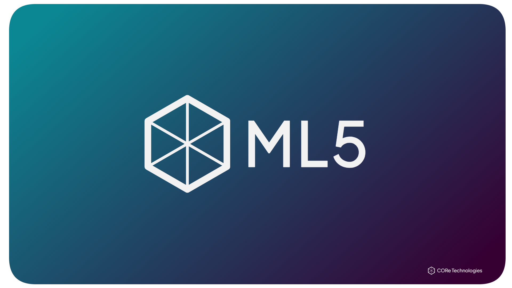

# ML5

<p align="center"></p>

[](https://opensource.org/licenses/MIT)

Local inference with a Rust CLI, a daemon, and native HTTP endpoints.
OpenAI-compatible API on `http://127.0.0.1:11435`.

## Features

- Rust-native inference on llama.cpp
- OpenAI, Anthropic, Ollama, and LM Studio compatible endpoints
- GGUF and safetensors model formats
- SSE streaming with progress events and token usage
- Model pull, list, load, unload, delete, and rename
- CUDA, Vulkan, and CPU backends
- Memory guard with automatic model eviction

## Quick Start (Windows)

### Prerequisites

- Rust 1.70+ (install from [rustup.rs](https://rustup.rs))
- Visual C++ Build Tools
- CMake
- libclang

### Build and Install

```powershell
# Clone the repository
git clone https://github.com/OpenCORe-Technologies/ML5.git
cd ML5

# Build release binaries
cargo build --release

# Install to user PATH
.\install.ps1

# Start the daemon
ml5d --background
```

### Basic Usage

```powershell
# Pull a model from Hugging Face
ml5 pull hf:owner/repo

# Pull with a specific quantization
ml5 pull hf:owner/repo --quant q4_k_m

# Pull a full safetensors model (requires --features safetensors build)
ml5 pull hf:meta-llama/Llama-3.1-8B-Instruct

# List installed models
ml5 list

# Rename a model
ml5 rename <model> <new-name>

# Run inference
ml5 run <model-name>

# One-shot with a message
ml5 run <model> --message "Explain quantum computing simply" --system "Be concise"

# Pipe input
"Summarize this text" | ml5 run <model> --quiet

# Advanced options
ml5 run <model> --ctx-size 4096 --max-tokens 1024 --temperature 0.7

# Check status
ml5 status
ml5 status --json

# Check for updates
ml5 update --check
ml5 update

# Stop the daemon
ml5d --stop
```

### Interactive Mode

```powershell
ml5 run <model>
```

Commands inside interactive chat:
- `/help` - Show available commands
- `/clear` - Reset conversation (preserves system prompt)
- `/model <name>` - Switch to a different model
- `/set system <text>` - Set system prompt
- `/exit` or `/quit` - Leave chat

## API Endpoints

### Native API (`/api/*`)

| Endpoint | Method | Description |
|----------|--------|-------------|
| `/api/chat` | POST | Chat completion with streaming |
| `/api/generate` | POST | Text generation |
| `/api/embed` | POST | Generate embeddings |
| `/api/models` | GET | List installed models |
| `/api/status` | GET | Daemon status and loaded models |
| `/api/pull` | POST | Pull a model from Hugging Face |
| `/api/delete` | POST | Delete a model |
| `/api/unload` | POST | Unload a model from memory |

### OpenAI-Compatible API (`/v1/*`)

| Endpoint | Method | Description |
|----------|--------|-------------|
| `/v1/chat/completions` | POST | OpenAI-style chat completion |
| `/v1/completions` | POST | OpenAI-style text completion |
| `/v1/embeddings` | POST | OpenAI-style embeddings |
| `/v1/models` | GET | List models in OpenAI format |
| `/v1/responses` | POST | OpenAI Responses API (Codex) |

### Anthropic-Compatible API (`/v1/*`)

| Endpoint | Method | Description |
|----------|--------|-------------|
| `/v1/messages` | POST | Anthropic Messages API |
| `/v1/messages/count_tokens` | POST | Token counting |

### Ollama-Compatible API (`/ollama/*`)

| Endpoint | Method | Description |
|----------|--------|-------------|
| `/ollama/api/generate` | POST | Generate (Ollama shape) |
| `/ollama/api/chat` | POST | Chat (Ollama shape) |
| `/ollama/api/tags` | GET | List models |
| `/ollama/api/show` | POST | Model info |
| `/ollama/api/version` | GET | Version |
| `/ollama/api/embeddings` | POST | Embeddings |
| `/ollama/api/ps` | GET | Running models |

## Model Formats

| Format | Backend | Description |
|--------|---------|-------------|
| GGUF | llama.cpp | Quantized models (default) |
| Safetensors | candle | Full HF models (Llama-family arch, feature-gated) |

## Configuration

### Daemon Options

```powershell
ml5d --help
```

Key options:
- `--host` / `--port`: Bind address (default: `127.0.0.1:11435`)
- `--models-dir`: Model storage directory (default: `~/.ml5/models`)
- `--ctx-size`: Default context size (default: 2048)
- `--gpu-layers`: GPU layers to offload (-1 for all, 0 for CPU only)
- `--max-memory-fraction`: Max memory usage before aborting load (default: 0.85)

Build with `cargo build --release --features safetensors` for safetensors support via candle.

### CLI Options

```powershell
ml5 --help
```

Global options:
- `--host`: Daemon address (default: `http://127.0.0.1:11435`)
- `--quiet`: Suppress progress and status messages

## GPU Support

ML5 supports GPU acceleration via dynamic backend loading:

```powershell
# Detect available GPUs
ml5 backend detect

# Download recommended backend
ml5 backend download

# Run with GPU offload
ml5d --gpu-layers -1  # All layers
ml5d --gpu-layers 32  # Specific layer count
```

**Note**: GPU support requires compatible llama.cpp backend libraries and a build with the `gpu` feature enabled.

## Development

### Running Tests

```powershell
# Run all tests
cargo test --workspace

# Run CLI tests only (no llama.cpp build required)
cargo test -p ml5
```

### Building from Source

```powershell
# Debug build
cargo build

# Release build
cargo build --release

# Build specific crate
cargo build -p ml5        # CLI only
cargo build -p ml5d       # Daemon only
cargo build -p ml5-core   # Core library only
```

### Code Quality

```powershell
# Format code
cargo fmt

# Run linter
cargo clippy --workspace --all-targets

# Check without building
cargo check --workspace
```

## Current Limitations

- **No benchmarking**: ML5 has not been benchmarked against Ollama or other inference engines
- **Single worker**: Each model has one inference worker; contexts are rebuilt per request
- **No KV cache reuse**: Prompt cache and continuous batching are not yet implemented
- **No resumable downloads**: Interrupted downloads must restart from scratch
- **Basic verification**: Downloads verify content length and GGUF magic, not cryptographic checksums
- **Windows-focused**: Primary development target is Windows; Linux/macOS support is untested

## Contributing

Contributions are welcome! Please see [CONTRIBUTING.md](CONTRIBUTING.md) for guidelines.

## License

This project is licensed under the MIT License - see the [LICENSE](LICENSE) file for details.

## Acknowledgments

- Built on [llama.cpp](https://github.com/ggerganov/llama.cpp)
- Inspired by [Ollama](https://ollama.ai/)
- Uses [axum](https://github.com/tokio-rs/axum) for the web framework
